# Tmaxsoft Redmine <!-- omit in toc -->

## Table of Contents <!-- omit in toc -->

* [Maintenance And Support](#maintenance-and-support)
* [Two Factor Authentication](#two-factor-authentication)
* [References](#references)

## I. Maintenance And Support

Enter https://redmine.tmaxsoft.com from you browser to access Tmaxsoft Redmine.  
To access Maintenance & Support page, please select project as Maintenance & Support by clicking top-right dropdown box.  

From the project page, click Issues tab to access issues page.

From the issues page, you can either search existing tickets or create new.  
To create new ticket, click on New issue. 

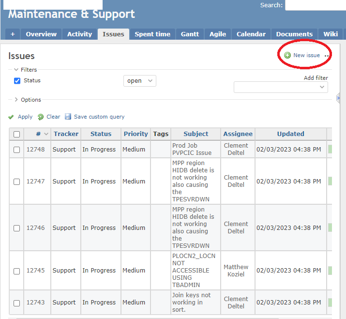

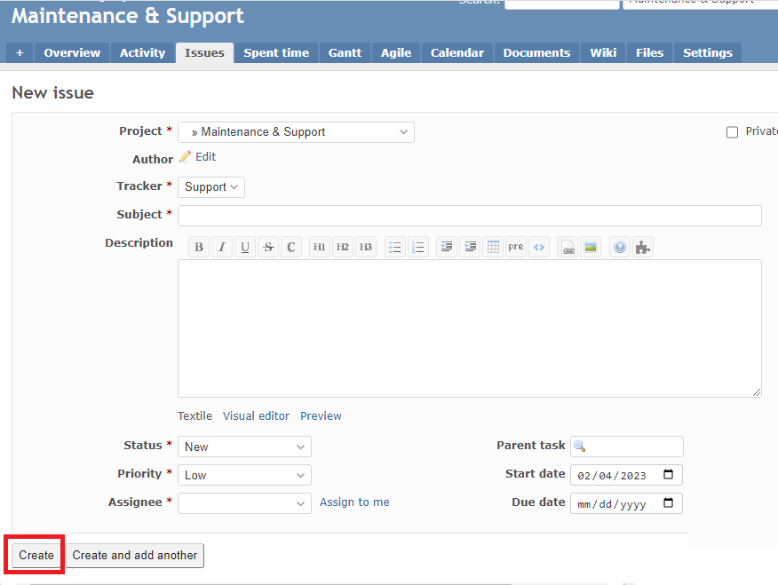

When creating a new issue, please fill out all the mandatory fields which is marked as '*'.  

For more information on how to use the Redmine, please refer to the official the Redmine guide page. https://www.redmine.org/guide

## II. Two Factor Authentication
### Introduction

Two Factor Authentication (or 2FA) is a feature to improve online account security, and in this case the security of the access to our Redmine instance.

First, a user will enter their username and a password. Then, instead of immediately gaining access, they will be required to provide another piece of information, which is here a 6-digits code from a 2FA app installed on a phone.

It is called 2FA because the user needs to provide two different pieces of information:

- something he/she knows, a password
- something he/she has, a phone with a 2FA app generating 6-digits

### Prerequisites

Before setting up your account 2FA, you need someone from your team, most likely your manager, to send a request to the Redmine administration team for your account creation.

### Configuration

**1.** Open a new page/tab of your favorite web browser and go to the Redmine login page: https://hub.tmaxsoft.com/redmine/login

> **Note**: On this login page there is also a Two Factor authentication guide if you need additional guidelines.

**2.** Type your credentials, username and password, and hit the button **Login** in the middle of the page.

**3.** The next page is a QR code. At this point, you need your phone.

> **Note**: Please don't try to scan the QR code in this guide. It will not work since it has been blurred and it is not associated with your Redmine account but with the Redmine account of the user used as an example in this guide, tfs.admin.

**4.** The recommended 2FA mobile app is **Google Authenticator**. Search for it on your phone in one of these two applications stores, iOS App Store or Android Play Store, depending on your operating system.

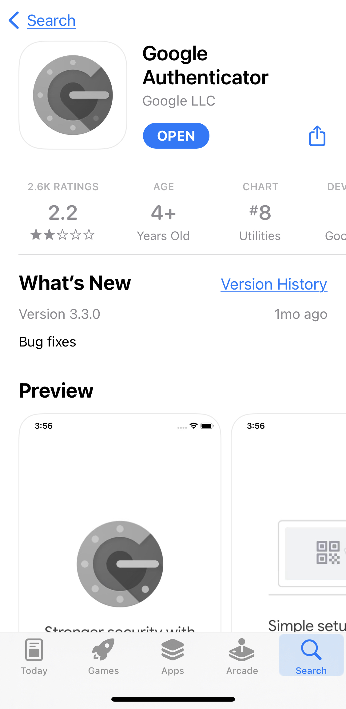

**5.** Open the application after successful installation. Hit the button **Start configuration** at the bottom of the screen.

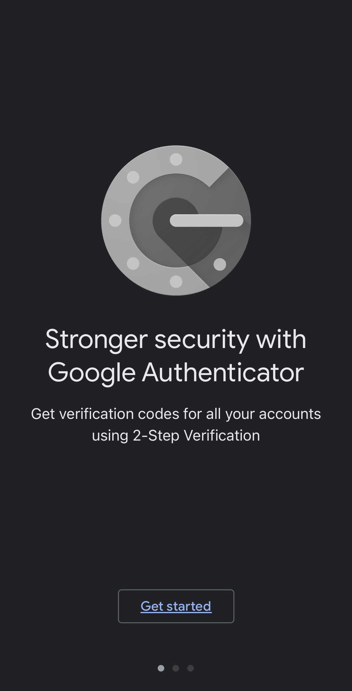

> **Note**: The steps to set it up might be slightly different depending on the type of phone you are using and the version of Google Authenticator installed.

**6.** Hit the button **Scan a QR code**. You have to grant access to **Google Authenticator** to your phone camera.

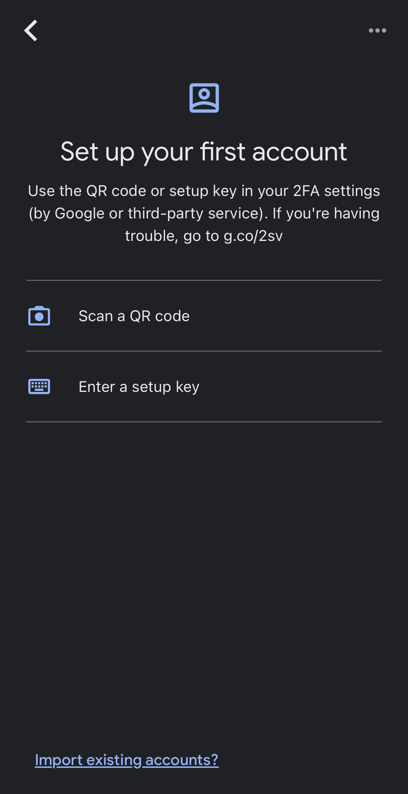

**7.** Point your phone at your computer screen where you have the QR Code on the Redmine page. Put the QR Code in the green square visible on your phone.

 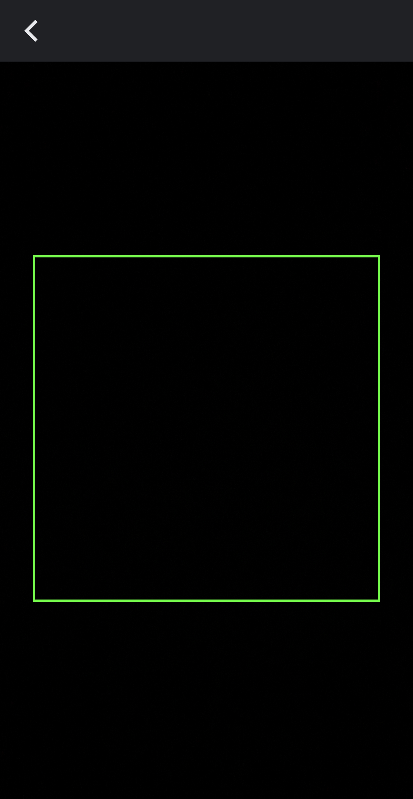

**8.** This should be setup by now. You should have six digits that change every 30 seconds in the application.

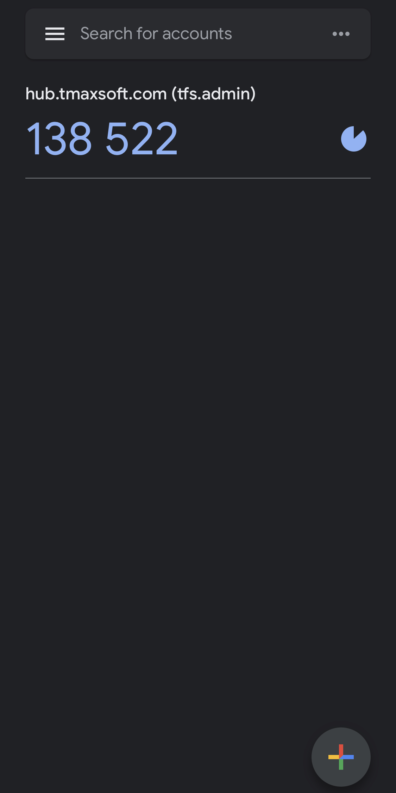
 
**9.** Go back to the Redmine page where you still have the page with the QR code on it. Enter these digits in the blank below. The next page will ask you to enter the same 6 digits again, please do so.

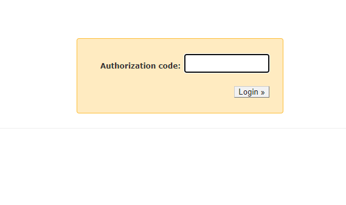

**10.** If it is your first time setting it up, and your fist time logging in the Redmine instance, you also need to reset and choose a personal password. This prevents the administrator to know about your password, only you should know about it.

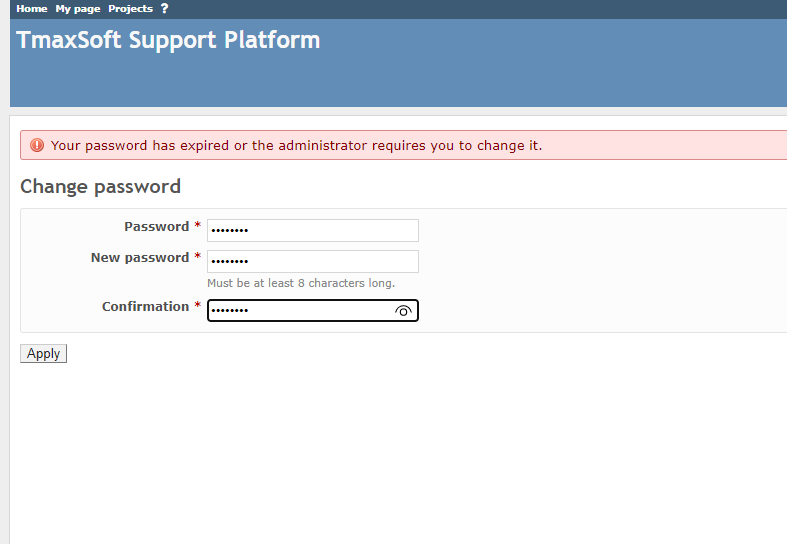

Congratulations! Everything is setup now. I recommend you to log out and log in back again to see what is the new behavior of Redmine now. First, id and password. Then, enter the 6 digits from your 2FA app and that's it!

### Two Factor Authentication reset

**1.** At any point in time, if you need to reset your 2FA (issue with the current code, changing to a new phone, lost or stolen phone...), go to your **My Account** page (top right corner).

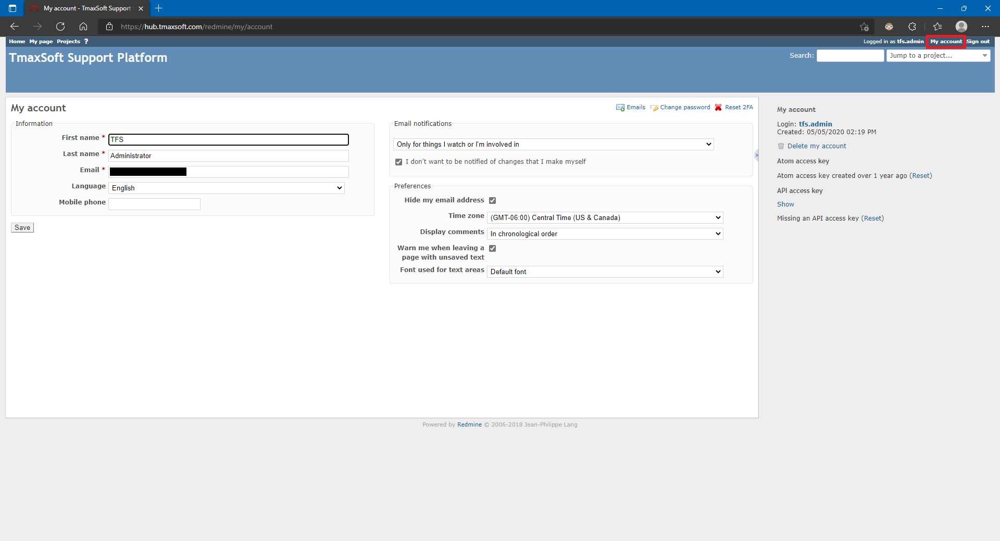

**2.** Hit the button **Reset 2FA**.

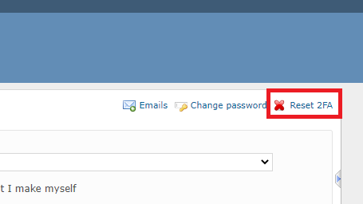

**3.** And then the button **Sign out** in the top left corner. Finally, try to log back in to set it up. You can follow the guide in the section just above.

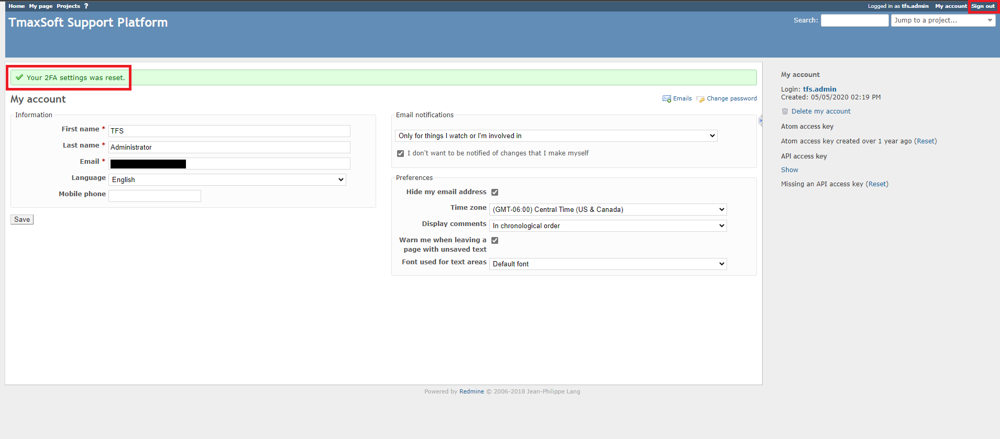

> **Note**: Please follow the guidelines above before asking any further questions to the Redmine administration team.

### Troubleshooting

If a user encountered a technical issue following this guide, the question asked as well as the resolution of the issue are listed here.

**1.** I am facing the error Wrong authorization code.

> You have an error in the 6-digits code you just entered, which could be of multiple reasons. Try again the same code, making sure there is an exact match with what is on your phone, or wait at least 30 seconds for the 2FA app to generate a new code.

**2**. I am facing the error **Limit exceeded of failed attempts. New authorization code sent**. It means that you tried 3 times to enter the 6-digits code without success.

> Wait at least 30 seconds at least for your 2FA app on your phone to generate a new 6-digits code and try it. If the issue persists, please contact Redmine administration team.

**3**. I am facing the error **Invalid form authenticity token**.

> Reload the Redmine page, or open the original URL of the login page: https://hub.tmaxsoft.com/redmine/login

**4**. I am facing another type of error, **Invalid user or password**.

> Hit the button **Lost password** on the login page.

> Type your email address. Hit the button **Submit**.

> Open the email you just received. You should have your user ID as well as a link to reset your password.

## III. References

**Redmine Guide** links:

- [Redmine Guide](https://www.redmine.org/guide)

**Google Authenticator** links:

- [Google Authenticator - Android Play Store](https://play.google.com/store/apps/details?id=com.google.android.apps.authenticator2&hl=en_US&gl=US)
- [Google Authenticator - iOS App Store](https://apps.apple.com/us/app/google-authenticator/id388497605)

Other resources:

- [Wikipedia - Multi Factor Authentication](https://en.wikipedia.org/wiki/Multi-factor_authentication)
